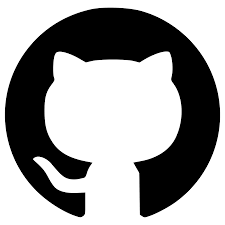

# Meu Primeiro Repo

## Sobre Nós 👩‍💻👨‍💻

Somos estudantes participantes da **16ª edição do Vem Ser DBC**, um programa de formação intensiva voltado ao desenvolvimento de habilidades técnicas e comportamentais para o mercado de tecnologia.

Nosso grupo está praticando os conceitos de Git e GitHub na prática, desenvolvendo projetos colaborativos e aprendendo a importância do versionamento de código no dia a dia de uma equipe de desenvolvimento.

| Nome       | GitHub                                             | Trilha    | Hobby    |
| ---------- | -------------------------------------------------- | --------- | -------- |
| Sara Sales | [@saracristinas](https://github.com/saracristinas) | FullStack | Comer    |
| Kaio M     | [@KaioPinto](https://github.com/KaioPinto)         | FullStack | Academia |
| Sarah V    | [@SaraahBR](https://github.com/SaraahBR)           | FullStack | Jogar    |
| Gabriela   | [@Gabssanjoss](https://github.com/Gabssanjoss)           | FullStack | Dormir   |

> Projeto criado durante as aulas práticas de Git.

## Objetivo

Criado para praticarmos comandos do GitHub.

 

## Projetos 
- Projeto 1: voltado à educação
- Projeto 2: e-commerce 
- Projeto 3: e-commerce de roupa e sapato